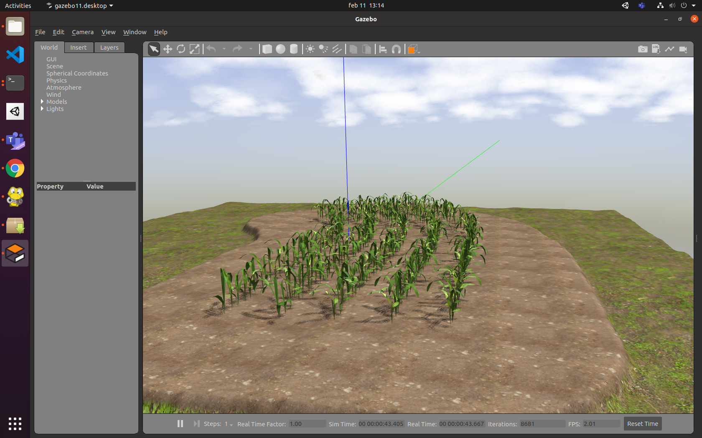

# Virtual Maize Field

<p float="left" align="middle">
  
</p>
<p float="left" align="middle"> 
   
  
  
</p>
<p align="middle">
  <a href="https://github.com/FieldRobotEvent/virtual_maize_field/actions/workflows/ros.yml"></a>
  <a href="https://github.com/psf/black"></a>
   <a href="https://pycqa.github.io/isort/"></a>
  <a href="https://github.com/FieldRobotEvent/Virtual_Field_Robot_Event/discussions"></a>
  <a href="https://www.gnu.org/licenses/gpl-3.0"></a>
</p>
<p align="middle">
  This is a package to procedurally generate randomized fields with rows of plants for Gazebo.
</p>



## Installation
This package has been tested on ROS melodic and ROS noetic.

Additional you'll need the following packages:

```commandline
# melodic
rosdep install virtual_maize_field
sudo apt install python3-pip
sudo pip3 install -U jinja2 rospkg opencv-python matplotlib shapely

# noetic
rosdep install virtual_maize_field
```

## Generating new maize field worlds
This package includes a script (`src/world_generator/generate_world.py`) that can generate randomized agricultural worlds. All parameters are optional and have default values. All comma separated arguments can be scaler as well. 

You can call the script using
```bash
rosrun virtual_maize_field generate_world.py
```
The resulting file will be placed in `worlds/generated.world`. You can use this script by one of the defined config files or specifying the parameters below:
<details>
  <summary>Click to show all possible arguments</summary>
  
  ```
  usage: generate_world.py [-h] [--row_length ROW_LENGTH]
                          [--rows_curve_budget ROWS_CURVE_BUDGET]
                          [--row_width ROW_WIDTH] [--rows_count ROWS_COUNT]
                          [--row_segments ROW_SEGMENTS]
                          [--row_segment_straight_length_min ROW_SEGMENT_STRAIGHT_LENGTH_MIN]
                          [--row_segment_straight_length_max ROW_SEGMENT_STRAIGHT_LENGTH_MAX]
                          [--row_segment_curved_radius_min ROW_SEGMENT_CURVED_RADIUS_MIN]
                          [--row_segment_curved_radius_max ROW_SEGMENT_CURVED_RADIUS_MAX]
                          [--row_segment_curved_arc_measure_min ROW_SEGMENT_CURVED_ARC_MEASURE_MIN]
                          [--row_segment_curved_arc_measure_max ROW_SEGMENT_CURVED_ARC_MEASURE_MAX]
                          [--row_segment_island_radius_min ROW_SEGMENT_ISLAND_RADIUS_MIN]
                          [--row_segment_island_radius_max ROW_SEGMENT_ISLAND_RADIUS_MAX]
                          [--ground_resolution GROUND_RESOLUTION]
                          [--ground_elevation_max GROUND_ELEVATION_MAX]
                          [--ground_headland GROUND_HEADLAND]
                          [--ground_ditch_depth GROUND_DITCH_DEPTH]
                          [--plant_spacing_min PLANT_SPACING_MIN]
                          [--plant_spacing_max PLANT_SPACING_MAX]
                          [--plant_height_min PLANT_HEIGHT_MIN]
                          [--plant_height_max PLANT_HEIGHT_MAX]
                          [--plant_radius PLANT_RADIUS]
                          [--plant_radius_noise PLANT_RADIUS_NOISE]
                          [--plant_placement_error_max PLANT_PLACEMENT_ERROR_MAX]
                          [--plant_mass PLANT_MASS] [--hole_prob HOLE_PROB]
                          [--hole_size_max HOLE_SIZE_MAX]
                          [--crop_types CROP_TYPES] [--litters LITTERS]
                          [--litter_types LITTER_TYPES] [--weeds WEEDS]
                          [--weed_types WEED_TYPES]
                          [--ghost_objects GHOST_OBJECTS]
                          [--location_markers LOCATION_MARKERS]
                          [--load_from_file LOAD_FROM_FILE] [--seed SEED]
                          [config_file]

  Generate a virtual maize field world for Gazebo.

  positional arguments:
    config_file           Config file name in the config folder

  optional arguments:
    -h, --help            show this help message and exit
    --row_length ROW_LENGTH
                          default_value: 12.0
    --rows_curve_budget ROWS_CURVE_BUDGET
                          default_value: 1.5707963267948966
    --row_width ROW_WIDTH
                          default_value: 0.75
    --rows_count ROWS_COUNT
                          default_value: 6
    --row_segments ROW_SEGMENTS
                          default_value: straight,curved
    --row_segment_straight_length_min ROW_SEGMENT_STRAIGHT_LENGTH_MIN
                          default_value: 1
    --row_segment_straight_length_max ROW_SEGMENT_STRAIGHT_LENGTH_MAX
                          default_value: 2.5
    --row_segment_curved_radius_min ROW_SEGMENT_CURVED_RADIUS_MIN
                          default_value: 3.0
    --row_segment_curved_radius_max ROW_SEGMENT_CURVED_RADIUS_MAX
                          default_value: 10.0
    --row_segment_curved_arc_measure_min ROW_SEGMENT_CURVED_ARC_MEASURE_MIN
                          default_value: 0.3
    --row_segment_curved_arc_measure_max ROW_SEGMENT_CURVED_ARC_MEASURE_MAX
                          default_value: 1.0
    --row_segment_island_radius_min ROW_SEGMENT_ISLAND_RADIUS_MIN
                          default_value: 1.0
    --row_segment_island_radius_max ROW_SEGMENT_ISLAND_RADIUS_MAX
                          default_value: 3.0
    --ground_resolution GROUND_RESOLUTION
                          default_value: 0.02
    --ground_elevation_max GROUND_ELEVATION_MAX
                          default_value: 0.2
    --ground_headland GROUND_HEADLAND
                          default_value: 2.0
    --ground_ditch_depth GROUND_DITCH_DEPTH
                          default_value: 0.3
    --plant_spacing_min PLANT_SPACING_MIN
                          default_value: 0.13
    --plant_spacing_max PLANT_SPACING_MAX
                          default_value: 0.19
    --plant_height_min PLANT_HEIGHT_MIN
                          default_value: 0.3
    --plant_height_max PLANT_HEIGHT_MAX
                          default_value: 0.6
    --plant_radius PLANT_RADIUS
                          default_value: 0.3
    --plant_radius_noise PLANT_RADIUS_NOISE
                          default_value: 0.05
    --plant_placement_error_max PLANT_PLACEMENT_ERROR_MAX
                          default_value: 0.02
    --plant_mass PLANT_MASS
                          default_value: 0.3
    --hole_prob HOLE_PROB
                          default_value: 0.06,0.06,0.04,0.04,0.0,0.0
    --hole_size_max HOLE_SIZE_MAX
                          default_value: 7,5,5,3,0,0
    --crop_types CROP_TYPES
                          default_value: maize_01,maize_02
    --litters LITTERS     default_value: 0
    --litter_types LITTER_TYPES
                          default_value: ale,beer,coke_can,retro_pepsi_can
    --weeds WEEDS         default_value: 0
    --weed_types WEED_TYPES
                          default_value: nettle,unknown_weed
    --ghost_objects GHOST_OBJECTS
                          default_value: False
    --location_markers LOCATION_MARKERS
                          default_value: False
    --load_from_file LOAD_FROM_FILE
                          default_value: None
    --seed SEED           default_value: -1
  ```
</details>

## Sample Worlds
In the [config folder](config/), config files to generate sample worlds are located. The parameters are chosen to match [the task description](https://www.fieldrobot.com/event/index.php/contest/)

Worlds for the Field Robot Event 2022:
| Name | Description |
|:---- |:----------- |
| *fre22_task_navigation* | Task navigation, curved rows that get more difficult (eg. have more and larger holes) to the left |
| *fre22_task_mapping* | Task mapping, field with random holes, bottles and weeds spread throughout the field. The cans, bottles and weeds have no collision box and are static. |

Other sample Worlds:
| Name | Description |
|:---- |:----------- |
| *fre21_task_1* | Task 1, curved rows without holes |
| *fre21_task_2* | Task 2, straight rows with holes |
| *fre21_task_3* | Task 3, similar crop rows as in task_2 but with cans, bottles and weeds spread throughout the field. The cans, bottles and weeds have no collision box and are static. |
| *fre21_task_4* | Task 4, similar crop rows as in task_2 but with cans, bottles and weeds spread throughout the field. The cans, bottles and weeds have a collision box and can be picked up. |

You can use these config files when generating worlds, e.g.:
```commandline
rosrun virtual_maize_field generate_world.py fre22_task_navigation_mini
```

## Launching worlds
The launch file to launch the worlds is called `simulation.launch`. You can launch the launch file by running `roslaunch virtual_maize_field jackal_simulation.launch`. By default the launch file will launch `generated_world.world`. You can launch any world by using the `world_name` arg. e.g. `roslaunch virtual_maize_field jackal_simulation.launch world_name:=simple_row_level_1.world`.

## License
Virtual Maize Field is copyright (C) 2021 *Farm Technology Group of Wageningen University & Research* and *Kamaro Engineering e.V.* and licensed under [](https://www.gnu.org/licenses/gpl-3.0).

### Models
| Name | Path | Copyright | License |
|:---- |:---- |:--------- |:------- |
| [Maize 01](models/maize_01/model.config) | `models/maize_01/` | 2021 *Kamaro Engineering e.V.* | [](https://creativecommons.org/licenses/by-sa/4.0/) |
| [Maize 02](models/maize_02/model.config) | `models/maize_02/` | 2021 *Kamaro Engineering e.V.* | [](https://creativecommons.org/licenses/by-sa/4.0/) |
| [Stone 01](models/stone_01/model.config) | `models/stone_01/` | 2020 *Andrea Spognetta* | [](https://creativecommons.org/licenses/by-nc/4.0/) |
| [Stone 02](models/stone_02/model.config) | `models/stone_02/` | 2014 *Sascha Henrichs* | [](https://creativecommons.org/licenses/by/4.0/) |
| [Ale](models/ale/model.config) | `models/ale/` | 2017 *elouisetrewartha* | [](https://creativecommons.org/licenses/by-nc/4.0/) |
| [Beer](models/beer/model.config) | `models/beer/` | ? *Maurice Fallon* | ? |
| [Coke Can](models/coke_can/model.config) | `models/coke_can/` | ? *John Hsu* | ? |
| [Nettle](models/nettle/model.config) | `models/nettle/` | 2019 *LadyIReyna* | [](https://creativecommons.org/licenses/by-nc/4.0/) |
| [Retro Pepsi Can](models/retro_pepsi_can/model.config) | `models/retro_pepsi_can/` | 2018 *FWTeastwood* | [](https://creativecommons.org/licenses/by/4.0/) |
| [Unknown Weed](models/unknown_weed/model.config) | `models/unknown_weed/` | 2016 *aaron_nerlich* | [](https://creativecommons.org/licenses/by/4.0/) |

### Textures
| Name | Path | Copyright | License |
|:---- |:---- |:--------- |:------- |
| [grass](https://cc0textures.com/view?id=Ground003) | [`Media/models/materials/textures/`](Media/models/materials/textures/) | 2018 *CC0Textures.com* | [](http://creativecommons.org/publicdomain/zero/1.0/) |
