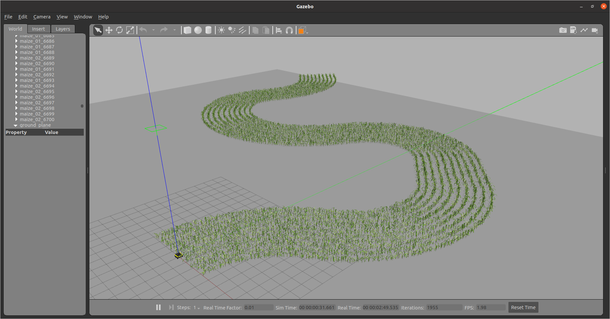

# Virtual Maize Field

<p float="left" align="middle">
  
</p>
<p float="left" align="middle"> 
   
  
  
</p>
<p align="middle">
  <a href="https://github.com/psf/black"></a>
  <a href="https://github.com/FieldRobotEvent/Virtual_Field_Robot_Event/discussions"></a>
  <a href="https://www.gnu.org/licenses/gpl-3.0"></a>
</p>
<p align="middle">
  This is a package to procedurally generate randomized fields with rows of plants for Gazebo.
</p>



## Installation
This package has been tested on `ROS melodic` and `ROS noetic`.

Additional you'll need the following packages:
```bash
# melodic
rosdep install virtual_maize_field
sudo apt install python3-pip
sudo pip3 install -U jinja2 rospkg
sudo pip3 install opencv-python
sudo pip3 install matplotlib

# noetic
rosdep install virtual_maize_field
```

## Generating new maize field worlds
This package includes a script (`scripts/generate_world.py`) that can generate randomized agricultural worlds. All parameters are optional and have default values. You can call the script using
```bash
rosrun virtual_maize_field generate_world.py
```
The resulting file will be placed in `worlds/generated.world`.
```
usage: world_description.py [-h] [--row_length ROW_LENGTH] 
                            [--row_width ROW_WIDTH] 
                            [--rows_left ROWS_LEFT] [--rows_right ROWS_RIGHT] 
                            [--rows_curve_budget ROWS_CURVE_BUDGET] 
                            [--row_segments ROW_SEGMENTS]
                            [--row_segment_straight_length_min ROW_SEGMENT_STRAIGHT_LENGTH_MIN] 
                            [--row_segment_straight_length_max ROW_SEGMENT_STRAIGHT_LENGTH_MAX]
                            [--row_segment_curved_radius_min ROW_SEGMENT_CURVED_RADIUS_MIN] 
                            [--row_segment_curved_radius_max ROW_SEGMENT_CURVED_RADIUS_MAX]
                            [--row_segment_curved_arc_measure_min ROW_SEGMENT_CURVED_ARC_MEASURE_MIN] 
                            [--row_segment_curved_arc_measure_max ROW_SEGMENT_CURVED_ARC_MEASURE_MAX]
                            [--plant_spacing_min PLANT_SPACING_MIN] [--plant_spacing_max PLANT_SPACING_MAX] 
                            [--plant_height_min PLANT_HEIGHT_MIN] [--plant_height_max PLANT_HEIGHT_MAX]
                            [--plant_radius PLANT_RADIUS] [--plant_radius_noise PLANT_RADIUS_NOISE] 
                            [--plant_placement_error_max PLANT_PLACEMENT_ERROR_MAX] 
                            [--plant_mass PLANT_MASS]
                            [--hole_prob HOLE_PROB]
                            [--max_hole_size MAX_HOLE_SIZE]
                            [--plant_types PLANT_TYPES] 
                            [--load_from_file LOAD_FROM_FILE] 
                            [--seed SEED]

Generate the json description for a virtual maize field.

optional arguments:
  -h, --help            show this help message and exit
  --row_length ROW_LENGTH
                        default_value: 15.0
  --row_width ROW_WIDTH
                        default_value: 0.75
  --rows_left ROWS_LEFT
                        default_value: 2
  --rows_right ROWS_RIGHT
                        default_value: 2
  --rows_curve_budget ROWS_CURVE_BUDGET
                        default_value: 1.5707963267948966
  --row_segments ROW_SEGMENTS
                        default_value: straight,curved
  --row_segment_straight_length_min ROW_SEGMENT_STRAIGHT_LENGTH_MIN
                        default_value: 1
  --row_segment_straight_length_max ROW_SEGMENT_STRAIGHT_LENGTH_MAX
                        default_value: 2.5
  --row_segment_curved_radius_min ROW_SEGMENT_CURVED_RADIUS_MIN
                        default_value: 3.0
  --row_segment_curved_radius_max ROW_SEGMENT_CURVED_RADIUS_MAX
                        default_value: 10.0
  --row_segment_curved_arc_measure_min ROW_SEGMENT_CURVED_ARC_MEASURE_MIN
                        default_value: 1
  --row_segment_curved_arc_measure_max ROW_SEGMENT_CURVED_ARC_MEASURE_MAX
                        default_value: 2.5
  --plant_spacing_min PLANT_SPACING_MIN
                        default_value: 0.13
  --plant_spacing_max PLANT_SPACING_MAX
                        default_value: 0.19
  --plant_height_min PLANT_HEIGHT_MIN
                        default_value: 0.3
  --plant_height_max PLANT_HEIGHT_MAX
                        default_value: 0.6
  --plant_radius PLANT_RADIUS
                        default_value: 0.3
  --plant_radius_noise PLANT_RADIUS_NOISE
                        default_value: 0.05
  --plant_placement_error_max PLANT_PLACEMENT_ERROR_MAX
                        default_value: 0.05
  --plant_mass PLANT_MASS
                        default_value: 0.3
  --hole_prob HOLE_PROB
                        default_value: 0.0
  --max_hole_size MAX_HOLE_SIZE
                        default_value: 7
  --plant_types PLANT_TYPES
                        default_value: maize_01,maize_02
  --load_from_file LOAD_FROM_FILE
                        default_value: None
  --seed SEED           default_value: None
```

## Sample Worlds
| Name | Parameters | Description |
|:---- |:--------- |:----------- |
| *simple_row_level_0.world* | `--plant_radius=0.03 --max_angle_variation=0 --plant_height=0.75 --radius_noise_range=0 --position_div=0 --types=cylinder` | One row with grid based cylinders. |
| *simple_row_level_1.world* | `--max_angle_variation=0 --position_div=0` | One row with grid based plants. |
| *simple_row_level_2.world* | `--max_angle_variation=0` | One row with more natural plant placement. |
| *simple_row_level_3.world* | default | One row with little curvature. |
| *simple_row_level_4.world* | `--max_angle_variation=0.3` | One row with curvature. |
| *simple_row_level_5.world* | `--dropout=0.1` | Level 3 with gaps |
| *simple_row_level_6.world* | `--max_angle_variation=0.3 --dropout=0.1` | Level 4 with gaps |

## Launching worlds
The launch file to launch the worlds is called `simulation.launch`. You can launch the launch file by running `roslaunch virtual_maize_field simulation.launch`. By default the launch file will launch `generated_world.world`. You can launch any world by using the `world_name` arg. e.g. `roslaunch virtual_maize_field simulation.launch world_name:=simple_row_level_1.world`.

## License
Virtual Maize Field is copyright (C) 2021 *Farm Technology Group of Wageningen University & Research* and *Kamaro Engineering e.V.* and licensed under [](https://www.gnu.org/licenses/gpl-3.0).

### Models
| Name | Path | Copyright | License |
|:---- |:---- |:--------- |:------- |
| [Maize 01](models/maize_01/model.config) | `models/maize_01/` | 2021 *Kamaro Engineering e.V.* | [](https://creativecommons.org/licenses/by-sa/4.0/) |
| [Maize 02](models/maize_02/model.config) | `models/maize_02/` | 2021 *Kamaro Engineering e.V.* | [](https://creativecommons.org/licenses/by-sa/4.0/) |
| [Stone 01](models/stone_01/model.config) | `models/stone_01/` | 2020 *Andrea Spognetta* | [](https://creativecommons.org/licenses/by-nc/4.0/) |
| [Stone 02](models/stone_02/model.config) | `models/stone_02/` | 2014 *Sascha Henrichs* | [](https://creativecommons.org/licenses/by/4.0/) |
| [Ale](models/ale/model.config) | `models/ale/` | 2017 *elouisetrewartha* | [](https://creativecommons.org/licenses/by-nc/4.0/) |
| [Beer](models/beer/model.config) | `models/beer/` | ? *Maurice Fallon* | ? |
| [Coke Can](models/coke_can/model.config) | `models/coke_can/` | ? *John Hsu* | ? |
| [Nettle](models/nettle/model.config) | `models/nettle/` | 2019 *LadyIReyna* | [](https://creativecommons.org/licenses/by-nc/4.0/) |
| [Retro Pepsi Can](models/retro_pepsi_can/model.config) | `models/retro_pepsi_can/` | 2018 *FWTeastwood* | [](https://creativecommons.org/licenses/by/4.0/) |
| [Unknown Weed](models/unknown_weed/model.config) | `models/unknown_weed/` | 2016 *aaron_nerlich* | [](https://creativecommons.org/licenses/by/4.0/) |
