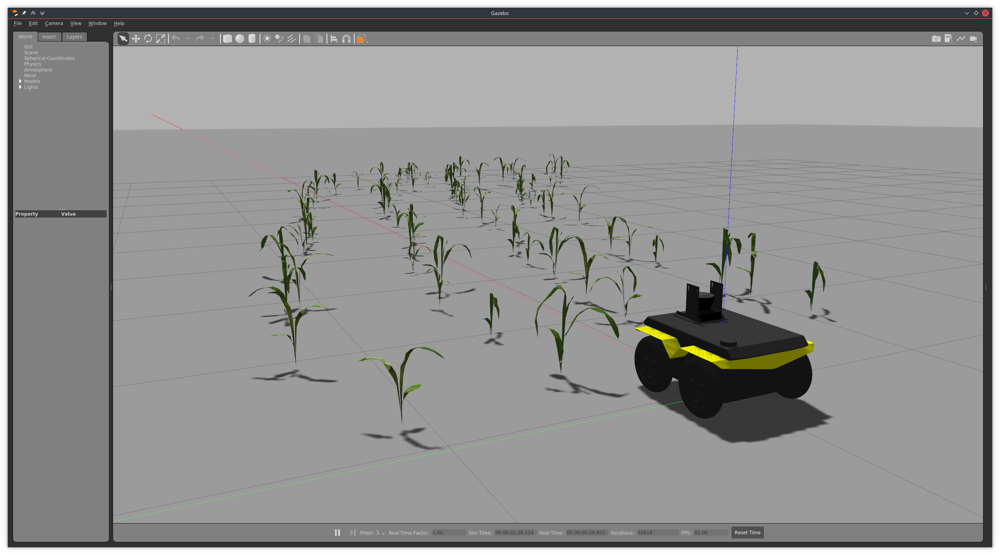

# Virtual Maize Field
This is a package to procedurally generate randomized fields with rows of plants for Gazebo.



## Installation
This package has been tested on `ROS melodic` and `ROS noetic`.

Additional you'll need the following packages:
```bash
# melodic
sudo apt install ros-melodic-gazebo-ros-pkgs python3-pip
sudo pip3 install -U jinja2 rospkg

# noetic
sudo apt install ros-noetic-gazebo-ros-pkgs \
                 python3-jinja2
```

## Generating new maize field worlds
This package includes a script (`scripts/generate_world.py`) that can generate randomized agricultural worlds. All parameters are optional and have default values. You can call the script using
```bash
rosrun virtual_maize_field generate_world.py
```
The resulting file will be placed in `worlds/generated.world`.
```
usage: generate_world.py [-h] [--plant_radius PLANT_RADIUS]
                         [--row_width ROW_WIDTH]
                         [--plant_offset PLANT_OFFSET]
                         [--max_angle_variation MAX_ANGLE_VARIATION]
                         [--num_plant_pairs NUM_PLANT_PAIRS]
                         [--num_rows_left NUM_ROWS_LEFT]
                         [--num_rows_right NUM_ROWS_RIGHT]
                         [--plant_height PLANT_HEIGHT]
                         [--plant_mass PLANT_MASS]
                         [--radius_noise_range RADIUS_NOISE_RANGE]
                         [--seed SEED]
                         [--types TYPES]

generate a world full of cylinders

optional arguments:
  -h, --help            show this help message and exit
  --plant_radius PLANT_RADIUS
                        default_value: 0.15
  --row_width ROW_WIDTH
                        default_value: 0.75
  --plant_offset PLANT_OFFSET
                        default_value: 0.5
  --max_angle_variation MAX_ANGLE_VARIATION
                        default_value: 0.15
  --num_plant_pairs NUM_PLANT_PAIRS
                        default_value: 20
  --num_rows_left NUM_ROWS_LEFT
                        default_value: 2
  --num_rows_right NUM_ROWS_RIGHT
                        default_value: 2
  --plant_height PLANT_HEIGHT
                        default_value: 0.3
  --plant_mass PLANT_MASS
                        default_value: 5.0
  --radius_noise_range RADIUS_NOISE_RANGE
                        default_value: 0.05
  --seed SEED           default_value: None
  --types TYPES         default_value: cylinder,maize_01,maize_02
```

## Sample Worlds
| Name | Parameters | Description |
|:---- |:--------- |:----------- |
| *simple_row_level_1.world* | `--max_angle_variation=0` | One row with grad based plants. |
| *simple_row_level_2.world* | TODO | One row with more natural plant placement. |
| *simple_row_level_3.world* | default | One row with little curvature. |
| *simple_row_level_4.world* | `--max_angle_variation=0.3` | One row with curvature. |
| *simple_row_level_5.world* | TODO | Level 3 with gaps |
| *simple_row_level_6.world* | TODO | Level 4 with gaps |

## License info
Virtual Maize Field is copyright (C) 2021 *Farm Technology Group of Wageningen University & Research* and *Kamaro Engineering e.V.* and licensed under GPLv3 (see [`LICENSE`](LICENSE)).
